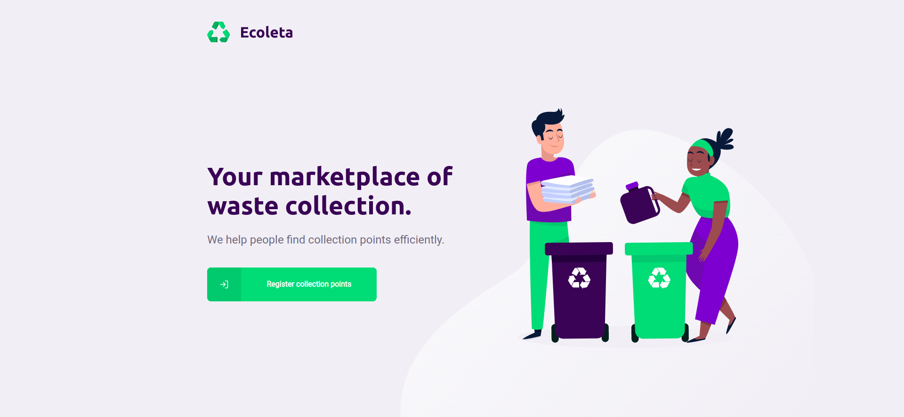
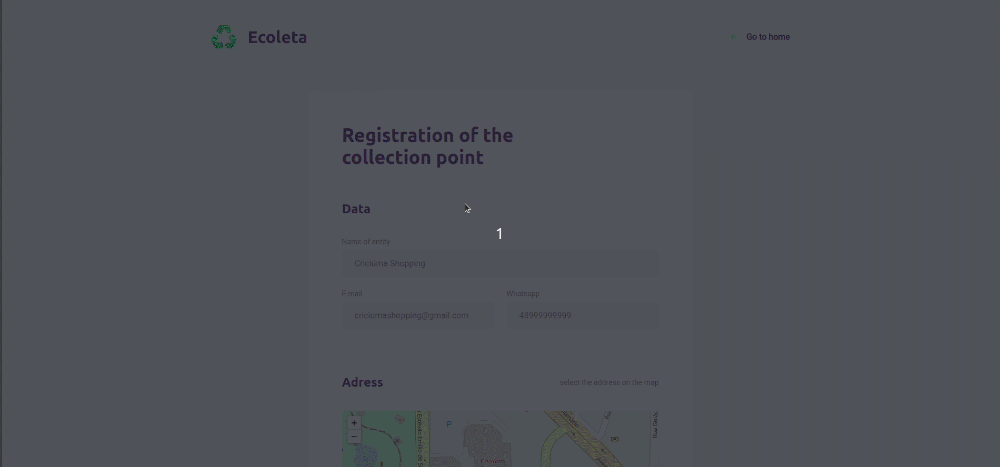

<h3 align="center">
   🌐 Ecollect Web
</h3>

🇺🇸 Ecoleta website, the Web application was made in ReactJS, using Typescript behind to help in the development, the website allows to register recyclable collection points, I used the [leaflet](https://react-leaflet.js.org/) for integration with the maps, and an external api made by the Brazilian Institute of Geography and Statistics (IBGE) and the api used to create the collection points is [here](https://github.com/kawaxzx/Ecollect/tree/master/Backend).

🇧🇷 Site do Ecoleta, a aplição Web foi feita em ReactJS, usando Typescript por trás para ajudar no desenvolvimento, o site permite cadastrar pontos de coleta de reciclaveis, fui usado o [leaflet](https://react-leaflet.js.org/) para integração com os mapas, e uma api externa feita pelo Instituto Brasileiro de Geografia e Estatística(IBGE) e a api utilizada para criar os pontos de coleta esta [aqui](https://github.com/kawaxzx/Ecollect/tree/master/Backend).

<h3 align="center">🏠 Home Page 💻</h3>

<h3 align="center">♻️ Create a Collect Point Page 🚮</h3>

